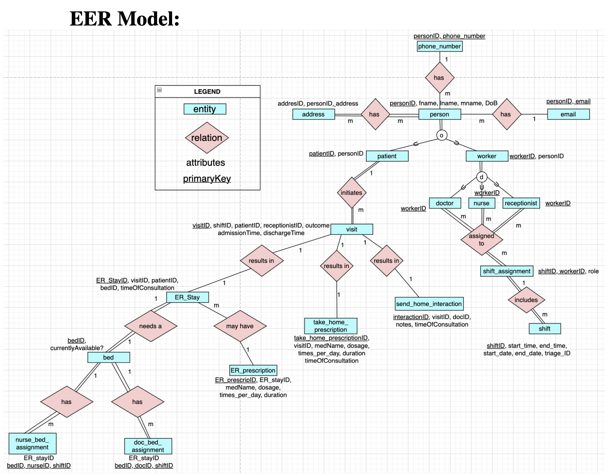
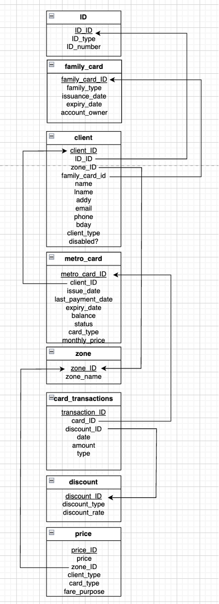

# Simulated Madrid Metro Database

I designed the database for Madrid's Metro system given specific requirements. I then implemented this database in SQL, populated the tables, and performed relevant queries to exemplify the design.

Please read the full report for more details, query examples, and relational algebra: [📄 View Full Project Report (PDF)](./report.pdf)

Note: This project was created for the IES Madrid / Universidad Carlos III de Madrid course *Files and Databases*.

---

## Diagrams

### EER Model

### Relational Schema

